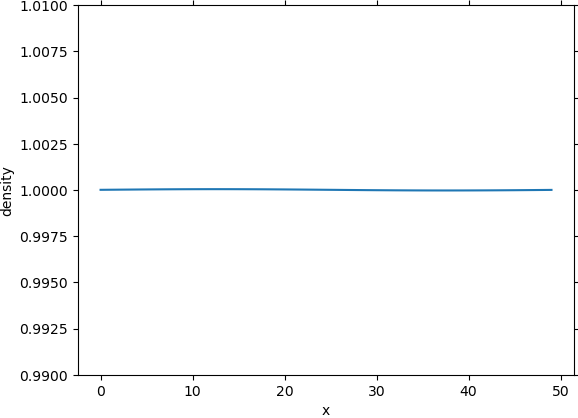
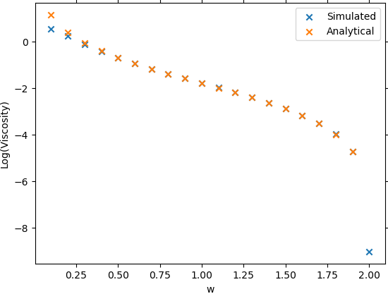
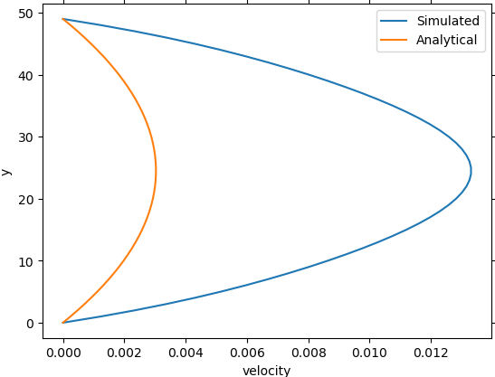
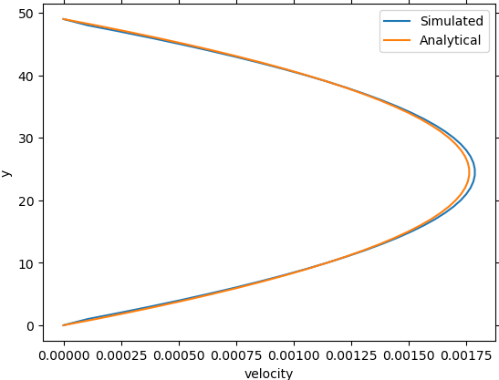

Lattice Boltzmann Simulation
============================

<p align="middle">
    
</p>


## Requirements
```bash
numpy
matplotlib
mpi4py
```

## Usage
All commands must be run in the project root.
```bash
git clone https://github.com/goktug97/LatticeBoltzmannSimulation
pip install -r requirements.txt

# Single thread
PYTHONPATH="$(pwd):$PYTHONPATH" python simulations/karman_vortex.py

# Parallel
PYTHONPATH="$(pwd):$PYTHONPATH" mpirun -np 2 python simulations/karman_vortex.py
```

Check `simulations` folder for more examples.

```python
import numpy as np
import matplotlib.pyplot as plt

import lb


nx = 50
ny = 50
n_steps = 3000
w = 0.3

x, y = np.meshgrid(np.arange(nx), np.arange(ny))

density = np.ones((ny, nx), dtype=np.float32)
velocity_field = np.zeros((ny, nx, 2), dtype=np.float32)
velocity_field[:, :, 1] = np.sin(2*np.pi/ny*y)

lbs = lb.LatticeBoltzmann(density, velocity_field)

for step in range(n_steps):
    print(f'{step+1}\\{n_steps}', end="\r")

    lbs.stream_and_collide(tau=1/w)

    if not step % 100:
        plt.cla()
        lbs.plot()
        plt.pause(0.001)
```

## Experiments
All commands must be run in the project root.
All results are saved into `results` folder.

### Shear Wave Decay Experiment
```bash
PYTHONPATH="$(pwd):$PYTHONPATH" mpirun -np 2 python experiments/shear_decay.py

```
#### Velocity Decay
||||
|:-:|:-:|:-:|
Step 0 | Step 200 | Step 400
Step 600 | Step 800 | Step 1000
Step 1200 | Step 1400 | Step 1600
Step 1800 | Step 2000 | Step 2999

#### Density Decay
||||
|:-:|:-:|:-:|
Step 0 | Step 200 | Step 400
Step 600 | Step 800 | Step 1000
Step 1200 | Step 1400 | Step 1600
Step 1800 | Step 2000 | Step 2999

### Shear Wave Simulated vs Analytical Viscosity
```bash
PYTHONPATH="$(pwd):$PYTHONPATH" mpirun -np 2 python experiments/shear_wave_viscosity.py
```
| Density                         | Velocity                         |
:--------------------------------:|:---------------------------------:
  | 

### Couette Flow
```bash
PYTHONPATH="$(pwd):$PYTHONPATH" mpirun -np 2 python experiments/couette_flow.py
```
||||
|:-:|:-:|:-:|
Step 0 | Step 200 | Step 400
Step 600 | Step 800 | Step 1000
Step 1200 | Step 1400 | Step 1600

### Poiseuille Flow
```bash
PYTHONPATH="$(pwd):$PYTHONPATH" mpirun -np 2 python experiments/poiseuille_flow.py
```
||||
|:-:|:-:|:-:|
Step 0 | Step 400 | Step 800
Step 1200 | Step 1600 | Step 2000
Step 2400 | Step 3200 | Step 3999

### Lid-driven Cavity
```bash
PYTHONPATH="$(pwd):$PYTHONPATH" mpirun -np 2 python experiments/sliding_lid.py
```
||||
|:-:|:-:|:-:|
Step 0 | Step 20000 | Step 40000
Step 60000 | Step 80000 | Step 99999
